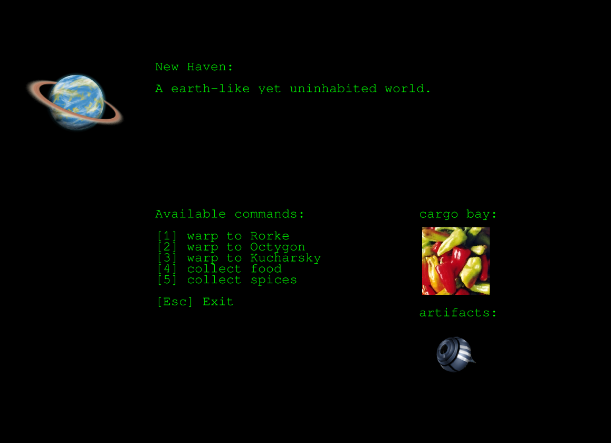

# Space

contact: krother@academis.eu

This is a small space traveling adventure. Warp between planets, trade goods, solve puzzles.

## Installation

    pip install -r requirements.txt

For development also do:

    pip install -r requirements_dev.txt

## Usage

    python space_game

To activate the German translation:

    export LANG=DE
    python space_game

## Web Front-End

There is a prototype web front-end:

    uvicorn --reload space_game.app:app

## License

(c) 2024 Kristian Rother.

Tim Weber, Veit Schiele and Frank Hofmann contributed to the front-end code.

Distributed under the conditions of the MIT License. See LICENSE file.

Artwork has been adopted from the Naev game. See `images/ARTWORK_LICENSE` for details.
