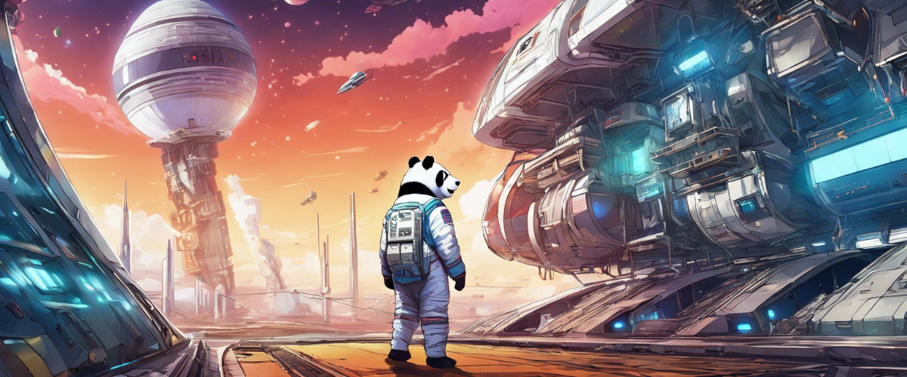
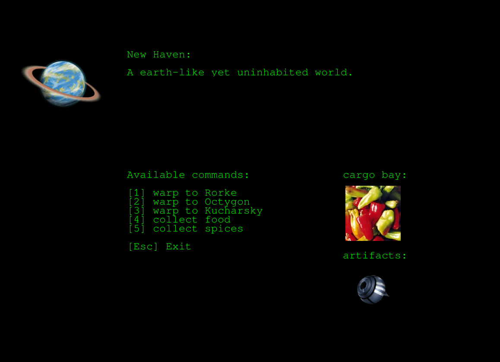

# Pandas go to Space

This is a small space traveling adventure. Warp between planets, recruit characters, trade goods, solve puzzles.

* see the [Refactoring Tutorial](refactoring.md)

## Installation

Install dependencies with:

    uv sync

## Usage

The game is playable through a command-line interface:

    uv run space_game

## Web Front-End

There is a prototype web front-end:

    uv run fastapi --reload space_game/app.py

## License

(c) 2026 Kristian Rother

contact: `kristian.rother@posteo.de`

Tim Weber, Veit Schiele and Frank Hofmann contributed to the front-end code.

Distributed under the conditions of the MIT License. See LICENSE file.

Artwork has been adopted from the Naev game. See `images/ARTWORK_LICENSE` for details.
