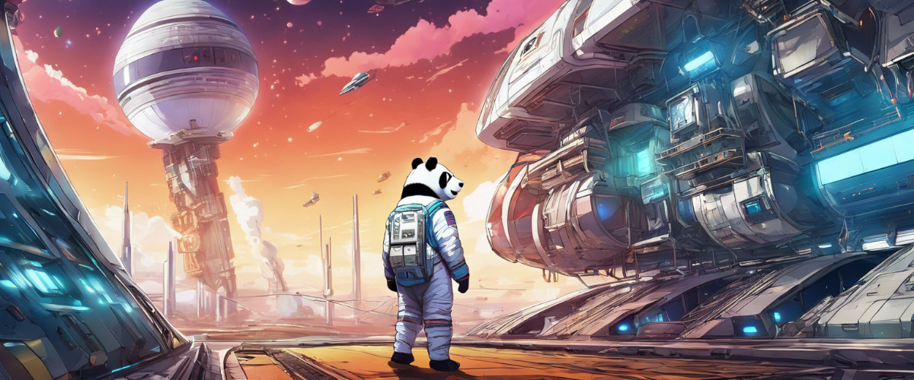

# Pandas go to Space

This is a small space traveling adventure. Warp between planets, recruit characters, trade goods, solve puzzles.

* see the [Refactoring Tutorial](refactoring.md)

## Installation

Install dependencies with:

    pip install -r requirements.txt

Install the necessary modules with:

    pip install -e .

For development also do:

    pip install -r requirements_dev.txt

You may need to checkout the [installation instructions of the arcade library](https://api.arcade.academy/en/latest/install/linux.html)

## Usage

The game is playable through a primitive GUI with keyboard entry:

    python space_game

## Web Front-End

There is a prototype web front-end:

    uvicorn --reload space_game.app:app

## License

(c) 2024 Kristian Rother.

contact: `kristian.rother@posteo.de`

Tim Weber, Veit Schiele and Frank Hofmann contributed to the front-end code.

Distributed under the conditions of the MIT License. See LICENSE file.

Artwork has been adopted from the Naev game. See `images/ARTWORK_LICENSE` for details.
