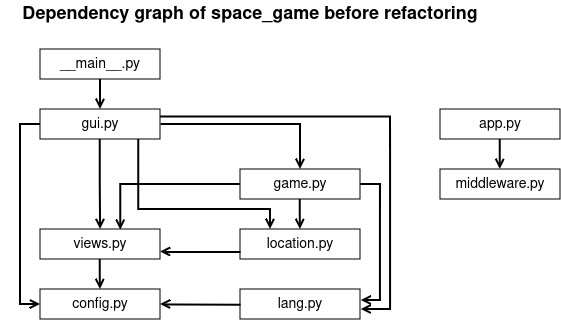
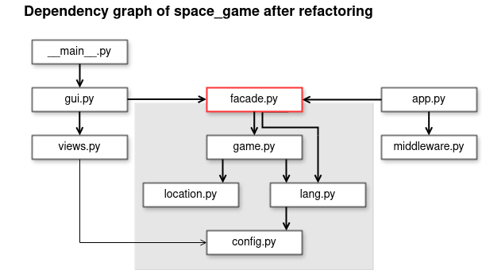

# Refactoring

## Goal

In this tutorial, you will add a web interface to the game.

## Overview

In this tutorial, you will perform a larger refactoring.
Let's disambiguate first. What is a larger refactoring?

In a simple refactoring like in LINK, you would follow the workflow:

1. run tests
2. modify the code
3. run tests again

Many small refactorings can be done in a few minutes.

But what should you do if:

- the refactoring breaks the tests
- there are no tests for the interface you need
- the code is a total mess

In this tutorial, we will work on the first two points.
The code for `space_game` has been cleaned up by many small refactorings: create short functions, clean up interfaces, create data structures etc.
**These small refactorings make big refactorings possible**.

## Prerequisites

This is an intermediate tutorial.
You should be familiar with command line and a text editor (VSCode, PyCharm).
If you have used Python exclusively in Jupyter or online editors until now, it may turn out to be very difficult to work on the exercises in the tutorial. Consider yourself warned.

## 1. Preparations

Create a virtual enironment using your preferred tooling. E.g. with `conda`:

    conda create -n space python=3.11

Then install the dependencies with:

    pip install -r requirements.txt
    pip install -r requirements_dev.txt

Also install the game with:

    python -m pip install -e .

Also check out the [installation instructions of the arcade library](https://api.arcade.academy/en/latest/install/linux.html).

## 2. Run tests

Run the tests:

    pytest

## 3. Play the game

You can run and play the game with a GUI interface:

    python space_game

## 4. Try the web interface

There is a prototype web interface that you can launch with:

    uvicorn --reload space_game.app:app

Visit your browser at [http://localhost:8000](http://localhost:8000)

## 5. Code Review

Take some time to read the code in `space_game/` so that you know what parts are there. The dependency graph may help you to get an overview:

## 6. Advanced Refactoring Workflow

Here is a workflow for more complex refactoring:

1. run tests
2. define a new interface
3. write tests against the new interface
4. implement the new interface within the old code
5. run tests
6. refactor
7. run tests

## 7. Define a new interface: Facade

In a larger refactoring, you have a chance to discover **Design Patterns**.
Design Patterns are well-described solutions to a problem.

Here, we have the following problem:

    Both the web app and the GUI need to connect to the game.
    
    The game and GUI are currently strongly intertwined.
    Doing that for the GUI would duplicate code.
    At least, the interface is not clean.

The [Facade Pattern](https://sourcemaking.com/design_patterns/facade) addresses this situation. 
We want to introduce one common interface that both web app and GUI can use. 

To implement the Facade pattern for the game, we need two convenience functions:

    def start_game() -> GameData:

    def execute_command(game_id: str, command: str) -> GameData:

You find a definition of `GameData` in `app.py`
`GameData` is a **data exchange object**. It is what we want to make public of our internal game objects.

## 8. Write a test against the new interface

To get started, let's add a simple test for each facade function.
Add the following to a new file `tests/test_facade.py`:

    from space_game.facade import (
        start_game,
        execute_command,
        GameData
    )

    def test_start_game():
        """game data is created""" 
        assert isinstance(start_game(), GameData)

    def test_execute_command():
        """command modifies data"""
        game = start_game()
        command = game.commands[0]
        game_new = execute_command(game.game_id)
        assert game_new.game_id == game.game_id
        assert game_new != game

Of course, the test should fail, because we have not implemented the Facade yet.

## 9. Implement the Facade (Part 1)

Create a new file `facade.py` and add the definition of the two functions:

    def start_game() -> GameData:
        ...

    def execute_command(game_id: str, command: str) -> GameData:
        ...

In `app.py` you find code for the two data exchange objects `GameData` and `LocationData`. Move them to `facade.py` as well.

In `gui.py` you find a `start_game()` function that we can borrow.
Move its code into our facade function.

Now all we need to do is to fill in a `GameData` object. With a bit of reading what attributes from `game.py` to use, you should get something like:

    def start_game() -> GameData:
        galaxy = create_galaxy(os.path.join(BASE_PATH, f"galaxy_{LANG}.json"))
        game = SpaceGame(location=galaxy["Pandalor"])

        return GameData(
            game_id = "1",
            location = LocationData(
                name = game.location.name,
                image = game.location.image,
                description = game.location.description,
            )
            cargo = game.cargo,
            crew = game.crew,
            commands = [cmd.name for cmd in game.commands],
            message = game.message,
        )

Leave the other function empty for now.

## 10. Run Tests

Run the tests for the Facade:

    pytest tests/test_facade.py

One of them should pass.

## 11. Connect GUI to Facade (Part 1)

It is very tempting to skip this step and work on the web app immediately.
This is very dangerous. If you go this way, you discard the value of the existing GUI tests and risk ending up with a program that is entirely broken.

Do the following:

- remove the `start_game()` function from `gui.py`
- create a `self.game` in the constructor of `SpaceGameWindow` and call the `start_game()` function from the Facade.
- remove the attribute `commands` from `SpaceGameWindow`
- move `SpaceGame.draw()` to the GUI (this is a smaller refactoring that was apparently overlooked during the preparations for the larger refactoring). Make a method `draw_game()` out of it.
- change the `draw_commands()` method from using a list of `Command` objects to using a list of strings.
- ignore the `move()` method for now.

Run the complete tests.
You should notice that a lot of the game is broken now.

## 12. Implement the Facade (Part 2)

Also implement the `facade.execute_command()` method by doing the following:

- persist the game object in the `start_game()` function. Use a global variable for now (this could be improved a lot, but it clearly is a separate refactoring).
- call `game.get_commands()` and identify the command the name of which matches the `command` parameter.
- call the `callback` attribute of the matching command.
- to return a `GameData` object, you might want to extract a helper function from `start_game()`.

Run the tests. Both tests for the Facade should pass now.

## 13. Connect GUI to Facade (Part 2)

Now, take care of the `gui.move()` function.
It should become a bit simpler.
Replace the last two lines by calling the facade:

    self.game = execute_command(self.game.game_id, cmd)

Run the tests again. All but one should pass.

## 14. Fix the tests

One of the tests uses the attribute `active` that does not exist in the Facade.
This attribute exposs the internal state of a core game object. It probably should not have been tested in the first place.

Remove the line using `active` from the test completely.

Now **all** the tests you have should pass.

If they work, you are done with the hard part. Congratulations!

## 15. Connect the Web Interface

Let's turn for the pleasant part: The web app.

The web app uses the **htmx** library and automatically redirects API functions to use a JINJA template.

All we need to do is to pass through the API call to the Facade (and remove the dummy data):

    @app.get("/new_game", response_model=GameData)
    def new_game() -> GameData:
        return start_game()

    @app.get("/action/{game_id}/{command}")
    def action(game_id: str, command: str) -> GameData:

## 16. Cleanup

A larger refactoring usually leaves a few piles of rubble.
You might do the following:

- review the code carefully
- run `black` or some other linter over it
- follow up with a few smaller refactorings

## Closing Remarks

This refactoring was done on a codebase of about 1000 lines using a well-defined recipe. The work behind the scenes to come up with a clean refactoring strategy took me about one day. I then condensed the steps to fit into a 90-minute tutorial. I rehearsed the refactoring 5 times before refactoring in front of a live audience.

In reality, expect the road to be more bumpy. You probably have a larger codebase, and will find more small refactorings on the way. You can estimate such a refactoring to take a couple of days, and may want to communicate that with your product team.

Still the core workflow outlined above applies. You may want to be clear about what exactly you are attempting to do, although there is not always a nice Design Pattern that gives the whole thing a name. Pairing up during the refactoring sounds like a good idea.

Nevertheless, it may happen that your refactoring runs into a dead end. Throwing away the code and starting over again is a viable strategy. Version control is your friend.

## Extra Challenge 1: Multiple games

One thing the new interface should make possible is running two or more games in parallel.
This was not possible in the original GUI (and did not make much sense either).

First, write a test that checks whether two games are different.

    def test_multiple_games():
        game1 = start_game()
        game2 = start_game()
        assert game1.game_id != game2.game_id

        game1 = execute_command(game1.game_id, game1.commands[0])
        game2 = execute_command(game2.game_id, game2.commands[0])
        assert game1.location.name1 == game2.location.name

The test should fail, if you assigned the same default id to all games.
To make the test pass, you need somthing like:

    import uuid
 
    game_id = str(uuid.uuid1())

## Extra Challenge 2: Persistence Layer

It is tempting to add a persistence layer (a database or similar) right away while building the Facade.
The persistence layer is a separate refactoring.
Doing two things at a time would complicate matters tremendously.

However, it is a good idea.
An easy way to store the games in a database is [SQLModel](https://sqlmodel.tiangolo.com/). You can reuse all the 

It is a good idea to move the code for the database into a separate module. The [Repository Pattern](https://www.cosmicpython.com/book/chapter_02_repository.html) is a good way to organize this type of functionality.

## Disclaimer

No real animals (pandas, pythons, unicorns etc.) were launched to space in the preparation of this tutorial.

## License

Distributed under the conditions of the MIT License. See LICENSE file.

With contributions by Kristian Rother, Tim Weber, Veit Schiele and Frank Hofmann.

Some artwork has been adopted from the Naev game. See `static/images/ARTWORK_LICENSE` for details.
The rest of the artwork was generated with [beta.dreamstudio.ai](https://beta.dreamstudio.ai/).
